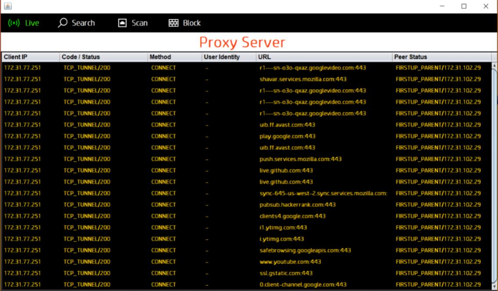
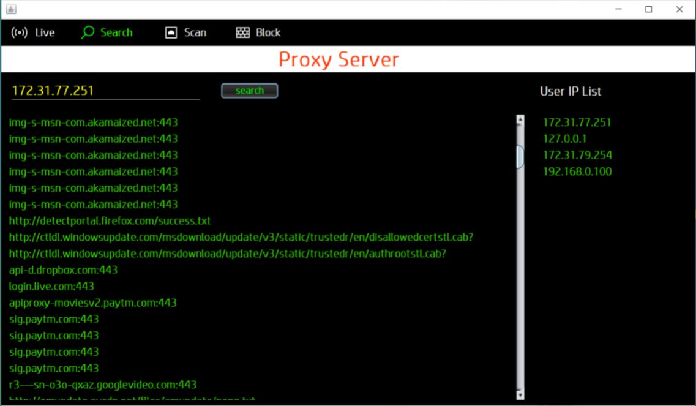
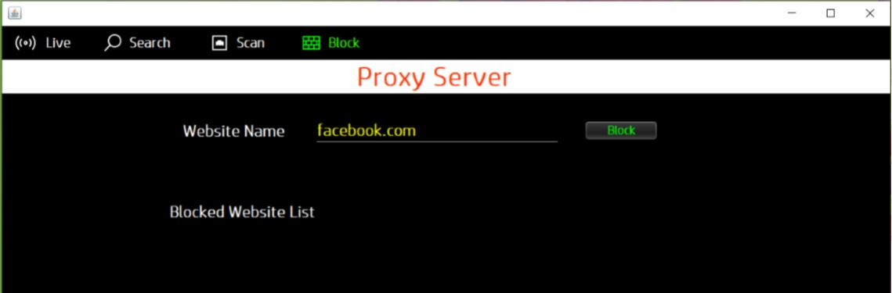

# Proxy_Server_Monitor
A Java application for monitoring and managing HTTP proxy server running <b>Squid</b>. It provides GUI for managing the proxy server. It can view the ongoing url requests from connected clients. It provides basic filteration of url requests on the basis of given client's IP address or url. It also allows to block access to specified website.

- Monitoring ongoing url requests

- Filter requests based on given client's IP address

- Block access to specified website

